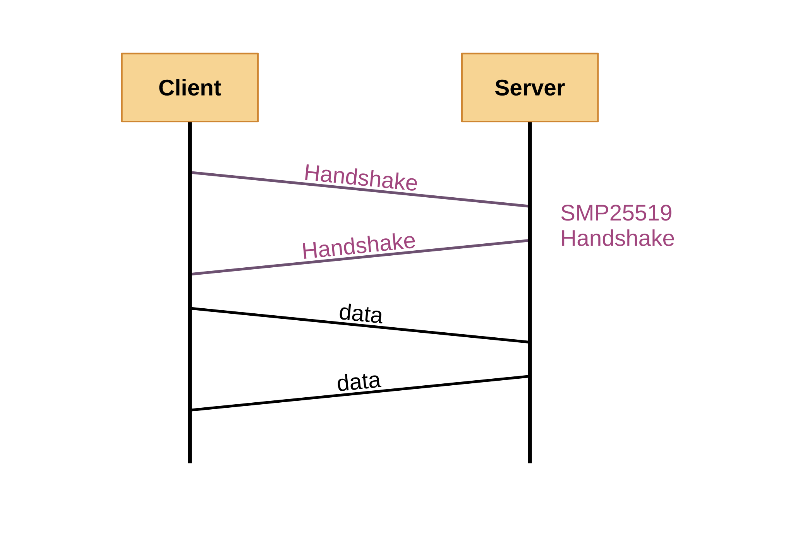

# SMP25519 | Secure Messaging Protocol 25519 | Rust

## Overview
SMP25519 is designed to facilitate secure communication using the X25519 key exchange, BLAKE3 hashing, and ChaCha20 encryption. It provides a straightforward interface for generating secure identities, creating handshake messages, deriving shared secrets, and encrypting/decrypting data.
## Installation
```
cargo add smp25519
```
## Dependencies
SMP25519 uses the following dependencies:
- [x25519-dalek](https://crates.io/crates/x25519-dalek)
- [blake3](https://crates.io/crates/blake3)
- [chacha20](https://crates.io/crates/chacha20)
## License
This package is distributed under the [Unlicense](https://choosealicense.com/licenses/unlicense/).
## Contact
For support or inquiries, contact truebreaker@proton.me.
# Examples
## Client
```rust
use smp25519;
use std::io::Write;
use base64::Engine;

const KNOWN_SERVER_PUBLIC_KEY: &str = "Vh4DBTYyDbwTqg1eZzTnuTxThscIoNQgLpxgsBCOFCU=";
const SERVER_ADDR: &str = "127.0.0.1:12000";
const BUFFER_SIZE: usize = 1024;
const MAX_RESPONSE_SIZE: usize = BUFFER_SIZE + smp25519::SMP25519_CONNECTION_ID_SIZE;

// Secure UDP client example using the smp25519 crate.
// This example demonstrates how to establish a secure communication channel
// with a server using key exchange and encryption. 
fn main() -> std::io::Result<()> {
    // Step 1: Generate client identity (private key, public key, and connection ID).
    let (private_key, public_key, connection_id) = smp25519::generate_identity();

    // Step 2 (RECOMMENDED): Define the server's known public key (Base64 encoded).
    let known_server_public_key = base64::prelude::BASE64_STANDARD.decode(KNOWN_SERVER_PUBLIC_KEY).unwrap();

    // Step 3: Create a UDP socket.
    let socket = std::net::UdpSocket::bind("127.0.0.1:0").unwrap();

    println!("Secure UDP Client: Attempting connection to {}", SERVER_ADDR);

    // Step 4: Send handshake message containing the client's public key.
    let handshake = smp25519::create_handshake_message(&public_key);
    socket.send_to(&handshake, SERVER_ADDR).unwrap();

    // Step 5: Receive and validate handshake response from the server.
    let mut buf = [0u8; BUFFER_SIZE];
    let (amt, _) = socket.recv_from(&mut buf).unwrap();
    if smp25519::is_handshake_message(&buf[..amt]) == false {
        eprintln!("Error: Handshake failed. Invalid response received.");
        return Ok(());
    }

    // Extract the server's public key from the handshake message.
    let server_public_key = smp25519::extract_public_key_from_handshake(&buf[..amt]);

    // (RECOMMENDED) Verify the server's public key.
    if server_public_key != known_server_public_key.as_slice() {
        eprintln!("Error: Known server public key mismatch. Aborting connection.");
        return Ok(());
    }

    // Step 6: Derive the shared secret using the server's public key and a salt.
    // let shared_secret = smp25519::derive_shared_secret(&private_key, &server_public_key, Some(b"examplesalt"));
    let shared_secret = smp25519::derive_shared_secret(&private_key, &server_public_key, None);

    // Step 7: Exchange encrypted messages with the server.
    loop {
        // Input message from the user.
        println!("Enter a message to send (or press Enter to retry): ");
        std::io::stdout().flush().unwrap();
        let mut line = String::new();
        std::io::stdin().read_line(&mut line).unwrap();
        let line = line.trim();

        if line.is_empty() {
            continue;
        }

        if line.eq_ignore_ascii_case("exit") {
            break;
        }

        // Encrypt and send the message.
        let mut buf = [0u8; BUFFER_SIZE];
        let bytes_written = smp25519::encrypt_and_send_data(connection_id, line.as_bytes(), &shared_secret, &mut buf);
        socket.send_to(&buf[..bytes_written], SERVER_ADDR).unwrap();

        // Receive and decrypt the server's response.
        let mut buf2 = [0u8; MAX_RESPONSE_SIZE];
        let (amt, src) = socket.recv_from(&mut buf2).unwrap();
        let bytes_written = smp25519::decrypt_received_data(&buf2[..amt], &shared_secret, &mut buf);
        println!("Server response from {}: {}", src.to_string(), std::str::from_utf8(&buf[..bytes_written]).unwrap());
    }

    Ok(())
}
```
## Server
```rust
use smp25519;
use base64::Engine;

const SERVER_PRIVATE_KEY: &str = "4Pe2QvF6zk41OWkMTqVR8e9nvwhbOEaDRti6oykaG18=";
const SERVER_ADDR: &str = "127.0.0.1:12000";
const BUFFER_SIZE: usize = 1024;
const MAX_RECEIVE_SIZE: usize = BUFFER_SIZE + smp25519::SMP25519_CONNECTION_ID_SIZE;

// Secure UDP server example using the smp25519 crate.
// This example demonstrates how to establish a secure communication channel with a single
// client at a time using key exchange and encryption.
fn main() {
    // Step 1: Generate the server's identity.
    // let (private_key, public_key, connection_id) = smp25519::generate_identity();

    // Or use a pre-existing private key (Base64 encoded) and derive the public key.
    let private_key_vec = base64::prelude::BASE64_STANDARD.decode(SERVER_PRIVATE_KEY).unwrap();
    let private_key: [u8; smp25519::SMP25519_PRIVATE_KEY_SIZE] = private_key_vec.try_into().unwrap();
    let public_key = smp25519::get_public_key_from_private(&private_key);

    println!("Server public key (Base64): {}", SERVER_PRIVATE_KEY);

    // Step 2: Set up the UDP socket and bind to a port.
    let socket = std::net::UdpSocket::bind(SERVER_ADDR).unwrap();
    println!("Secure UDP Server: Listening on {}", SERVER_ADDR);

    // Variables to store client-specific connection data.
    let mut client_connection_id: u64 = 0;
    let mut client_shared_secret = [0u8; smp25519::SMP25519_SHARED_SECRET_SIZE];

    // Step 3: Main server loop.
    loop {
        // Receive data from a client.
        let mut buf = [0u8; MAX_RECEIVE_SIZE];
        let (amt, src) = socket.recv_from(&mut buf).unwrap();
        println!("Connection from {}", src.to_string());

        // Step 4: Handle handshake messages.
        if smp25519::is_handshake_message(&buf[..amt]) == true {
            println!("Handshake received from {}", src.to_string());

            // Extract the client's public key and generate a connection ID.
            let client_public_key = smp25519::extract_public_key_from_handshake(&buf[..amt]);
            client_connection_id = smp25519::generate_connection_id_from_public_key(&client_public_key);

            // Derive a shared secret using the client's public key and a salt.
            // client_shared_secret = smp25519::derive_shared_secret(&private_key, &client_public_key, Some(b"examplesalt"));
            client_shared_secret = smp25519::derive_shared_secret(&private_key, &client_public_key, None);

            // Respond with the server's handshake message.
            let handshake = smp25519::create_handshake_message(&public_key);
            socket.send_to(&handshake, src).unwrap();
            println!("Handshake completed.");

            continue;
        }

        // Step 5: Handle encrypted messages.
        if smp25519::is_valid_data(&buf) == true {
            // Verify the connection ID matches the client.
            if smp25519::extract_connection_id_from_data(&buf) != client_connection_id {
                eprintln!("Error: Unknown client ID from {}. Ignoring message.", src.to_string());
                continue;
            }

            // Decrypt the received message.
            let mut decrypted_message = [0u8; BUFFER_SIZE];
            let bytes_written = smp25519::decrypt_received_data(&buf[..amt], &client_shared_secret, &mut decrypted_message);
            println!("Message from {}: {}", src.to_string(), std::str::from_utf8(&decrypted_message[..bytes_written]).unwrap());

            // Send an encrypted response back to the client.
            let response_message = b"Hello from Server!";
            let bytes_written = smp25519::encrypt_and_send_data(client_connection_id, response_message, &client_shared_secret, &mut buf);
            socket.send_to(&buf[..bytes_written], src).unwrap();

            continue;
        }

        // Step 6: Handle unrecognized data.
        eprintln!("Error: Received unknown data from {}", src.to_string());
    }
}
```